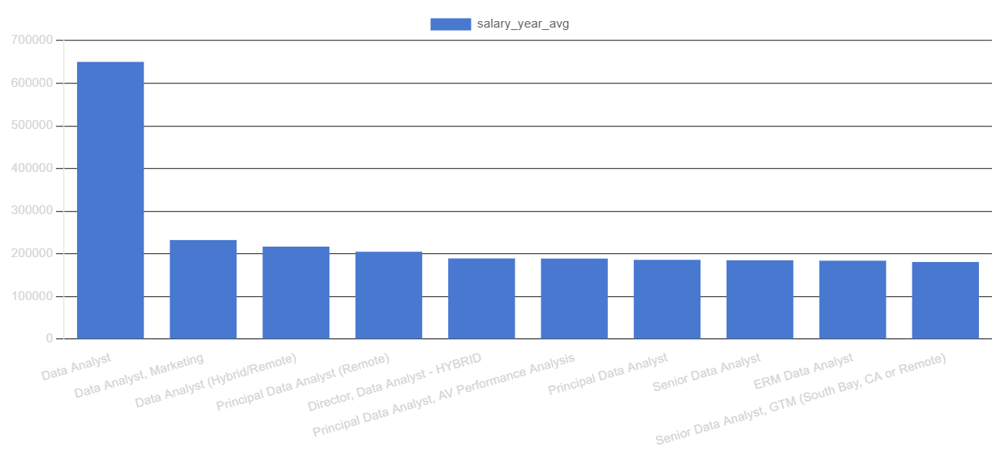
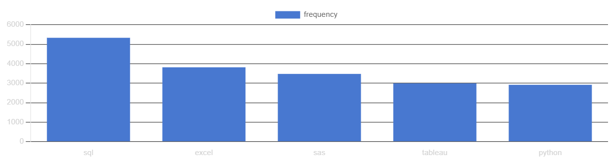

# 📊 Data Analyst Job Market Analysis 2023 (SQL Project)

## 🧠 Project Overview
This project provides a comprehensive analysis of the **2023 Data Analyst job market** using SQL to identify:  
- 💰 **Top-paying roles**  
- 🔥 **Most in-demand skills**  
- 📈 **The relationship between skills and salary**

By analyzing real-world job posting data, the project highlights the most valuable skills for Data Analysts and provides **actionable insights** for career planning and skill development.

---

## 🎯 Objectives & Key Questions

The main goal of this project is to analyze the 2023 Data Analyst job market to answer the following questions:

1. Which Data Analyst roles offer the highest salaries in 2023?  
2. What skills are required for these top-paying roles?  
3. Which skills are most frequently requested in Data Analyst job postings?  
4. Which skills are associated with higher salaries?  
5. What are the most strategic skills to learn based on demand and compensation?

---

## 🛠 Tools & Technologies

The project was executed using:

- **SQL** – for querying and analyzing datasets  
- **PostgreSQL** – database management system  
- **Visual Studio Code** – writing and executing SQL scripts  
- **Git & GitHub** – version control and project sharing  

---

## 📊 Analysis & Findings

### 1. Top-Paying Data Analyst Jobs

The analysis shows that **remote Data Analyst roles** in 2023 can offer highly competitive salaries, ranging from approximately **$184,000 up to $650,000 annually**.  

**Key Insights:**
- The top 10 positions are primarily offered by well-established, data-driven companies.  
- High salaries are associated with advanced analytical and technical expertise.  
- Remote work is increasingly common in high-paying roles, offering location flexibility.  
- Notable employers include **SmartAsset, Meta, and AT&T**.  

---

### 2. Skills for Top-Paying Jobs

By joining job postings with their required skills, we identified the competencies **most valued in high-paying roles**:

**Top Skills (Top 10 Highest-Paying Roles – 2023):**
- **SQL:** Required in 8 out of 10 top-paying jobs  
- **Python:** Required in 7 roles  
- **Tableau:** Required in 6 roles  
- Other notable skills: **R, Snowflake, Pandas, Excel**

**Insight:** Strong database querying, programming, and data visualization skills are critical for securing top-paying Data Analyst positions.

---

### 3. Most In-Demand Skills

By analyzing job posting frequencies, the project highlights the skills most frequently requested:

**Key Skills:**
- **SQL & Excel:** Foundational for data processing and reporting  
- **Python, Tableau, Power BI:** Increasingly essential for data storytelling and decision support  

---

### 4. Skills & Salary Relationship

Examining average salaries associated with specific skills provides insight into which competencies **command higher pay**:

**High-Paying Skills:**
- **Big Data & Machine Learning:** PySpark, Couchbase, DataRobot, Jupyter  
- **Python Libraries:** Pandas, NumPy  
- **Development & Deployment Tools:** GitLab, Kubernetes, Airflow  
- **Cloud Platforms & Data Engineering Tools:** Elasticsearch, Databricks, GCP  

**Insight:** Expertise in predictive modeling, automation, and cloud-based analytics significantly boosts earning potential.

---

### 5. Optimal Skills to Learn

Combining **demand** and **salary insights** allows identification of skills that maximize career value:

| Skill Category | Skills | Demand Count | Average Salary |
|----------------|--------|--------------|----------------|
| Programming | Python, R | 236, 148 | ~$101,397, $100,499 |
| Cloud & Big Data | Snowflake, Azure, AWS, BigQuery | High | High |
| BI & Visualization | Tableau, Looker | 230, 49 | ~$99,288, $103,795 |
| Databases | SQL, Oracle, NoSQL | High | ~$97,786–$104,534 |

**Insight:** SQL remains a cornerstone skill, while cloud technologies, BI tools, and advanced programming provide high market value and salary potential.

---

## ✅ Conclusions

1. **Top-Paying Jobs:** Remote roles can reach salaries up to **$650,000**, emphasizing the value of advanced analytics skills.  
2. **Skills for High Salaries:** **SQL, Python, Tableau** are critical for top-paying positions.  
3. **Most In-Demand Skills:** **SQL** continues to dominate demand, making it essential for job seekers.  
4. **Salary-Linked Skills:** Specialized skills (e.g., SVN, Solidity, big data tools) are associated with higher compensation.  
5. **Strategic Skill Development:** Learning **SQL, Python, cloud tools, BI platforms, and database technologies** optimizes market value and career opportunities.
